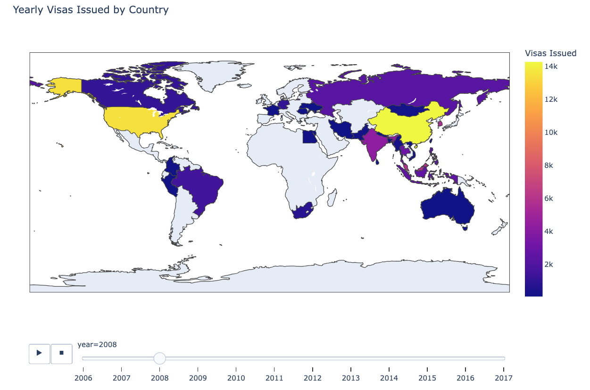

# 🛂 Japan Visa Data Pipeline: Airflow, Snowflake & dbt

An end-to-end ELT data pipeline that extracts Japan visa issuance data from an S3 external stage, loads it into a Snowflake cloud data warehouse, transforms and enriches it using dbt and Snowpark Python UDFs, and dynamically generates an interactive animated choropleth map hosted on AWS S3.

This project demonstrates modern Data Engineering workflows and is architected to run seamlessly in a Containerized Docker Environment.

# **📊 Interactive Visualization**

Click here to view the Live Interactive Animated Map on AWS S3:

https://nestdataops-822872386722-us-east-1-an.s3.us-east-1.amazonaws.com/output/japan\_visas\_animated.html

# **🏗️ Architecture & Engineering Highlights**

* **Automated Infrastructure Provisioning:** Apache Airflow dynamically sets up Snowflake compute warehouses, databases, schemas, internal stages for Python packages, and external S3 stages using the SnowflakeOperator.  
* **S3 & Snowflake Integration:** Ingests raw CSV data directly from Amazon S3 into Snowflake staging tables (JAPAN\_VISA\_DB.RAW).  
* **Snowpark Python UDFs & Caching:** Utilizes custom Snowpark UDFs to clean column headers, normalize country names, and perform geospatial mapping to continents using cached third-party libraries (pycountry) uploaded directly to Snowflake internal stages (MY\_PYTHON\_STAGE).  
* **dbt Transformations:** Modular dbt SQL models organize and clean data into production-ready analytical tables (JAPAN\_VISA\_DB.CLEANED).  
* **Automated Dashboarding & S3 Delivery:** An end-of-pipeline Python task queries the cleaned Snowflake data, generates an animated Plotly choropleth map, and automatically uploads the rendered web asset directly to AWS S3 using the S3Hook.  
* **Dependency Isolation (Docker):** Leverages a custom Docker setup with dedicated virtual environments for dbt to eliminate dependency conflicts between Airflow and dbt-core.

# **❄️ Phase 1: Automated Snowflake Setup**

The set\_up\_visa.py Airflow DAG automates the foundational database, schema, table, and stage creation. When triggered, it executes the following steps:

1\. Creates the compute warehouse (JAPAN\_VISA\_WH).  
2\. Creates the database (JAPAN\_VISA\_DB) and schemas (RAW, CLEANED).  
3\. Uploads required Python .whl packages (pycountry, pycountry\_convert) to the internal stage.  
4\. Ingests raw CSV data into RAW\_VISA\_NUMBER\_IN\_JAPAN.  
5\. Executes downstream dbt transformations and data tests.  
6\. Generates the interactive Plotly map and pushes it to AWS S3.

# **🚀 Phase 2: Execution Environments**

## **Run via Docker (Recommended)**

1\. Initialize and Build  
  docker compose up airflow-init  
  docker compose build

2\. Start the Cluster  
  docker compose up \-d

3\. Access the Airflow UI  
  URL: http://localhost:8080  
  Username: airflow  
  Password: airflow

4\. Teardown Environment  
  docker compose down

# **🔗 Phase 3: Airflow Connections Setup**

Before running the DAGs, configure the connection credentials in the Airflow UI (Admin \-\> Connections):

## **1\. Snowflake Connection**

* Connection Id: snowflake\_default  
* Connection Type: Snowflake  
* Schema: RAW  
* Login: \<Your Snowflake Username\>  
* Password: \<Your Snowflake Password\>  
* Account: \<Your Snowflake Account Identifier\>  
* Database: JAPAN\_VISA\_DB  
* Warehouse: JAPAN\_VISA\_WH  
* Role: ACCOUNTADMIN

## **2\. AWS Connection**

* Connection Id: aws\_default  
* Connection Type: Amazon Web Services  
* AWS Access Key ID: \<Your AWS Access Key\>  
* AWS Secret Access Key: \<Your AWS Secret Key\>

# **🏃‍♂️ Phase 4: Running the Pipeline**

1\. In the Airflow UI, locate and trigger japan\_visa\_snowflake\_setup.  
2\. Airflow will provision the Snowflake infrastructure, load raw data from S3, run dbt models with Snowpark UDFs, generate the Plotly visualization, and upload the HTML artifact to S3.  
3\. Access the output interactive map at:  
    https://nestdataops-822872386722-us-east-1-an.s3.us-east-1.amazonaws.com/output/japan\_visas\_animated.html  
4\. Once finished, run the japan\_visa\_snowflake\_teardown DAG to safely drop warehouses and databases to minimize costs.
